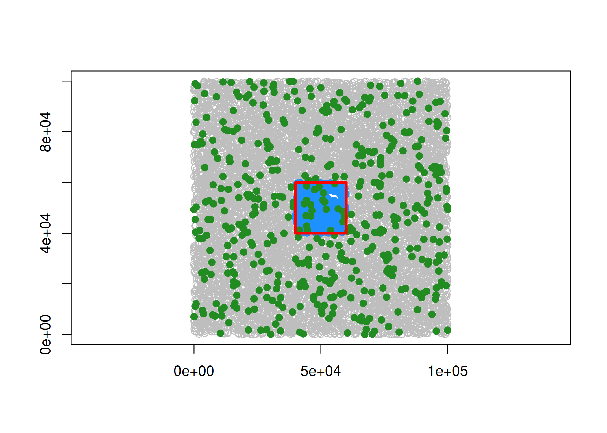

<!-- README.md is generated from README.Rmd. Please edit that file -->

<!-- badges: start -->

<h1 align="center"><code>geosx</code></h1>

<p align="center">

<!-- <a href="https://github.com/atsyplenkov/geosx/releases"></a> -->

<!-- <a href="https://cran.r-project.org/package=geosx">
        </a> -->

<a href="https://app.codecov.io/gh/atsyplenkov/geosx"></a>
<a href="https://github.com/atsyplenkov/geosx/actions/workflows/R-CMD-check.yaml"></a>
</p>

<!-- badges: end -->

The `geosx` package provides a collection of common tools for vector
geometry operations as an extension to
[`geos`](https://github.com/paleolimbot/geos). It is a highly
experimental and opinionated library, with a focus on performance,
simplicity and lightweightness. I originally put this package together
for my own projects, collecting handy functions I kept reusing.

> [!note] 
> This package is still in development and API is subject to change.

## Installation

You can install the development version of geosx like so:

``` r
# install.packages("pak")
pak::pak("atsyplenkov/geosx")
```

## Examples

For example, one can generate a grid of polygons over some points and
find the points within the central grid cell, or find standalone points
(those which stand within a user-defined distance from other points):

``` r
library(geos)
library(geosx)

# Generate some random points
pts <- wk::xy(
  x = runif(10000, 0, 100000),
  y = runif(10000, 0, 100000)
) |>
  geos::as_geos_geometry()

# Generate a grid of polygons over the points
grid <- geos_make_grid(pts, 5, 5)

# Find the points within the central grid cell
pts_within <- geos_str_intersection(pts, grid[13])

# Or find standalone points (those which stand within `maxdist`)
pts_standalone <- geos_standalone_points(pts, 1000)

# Plot the points and the grid
plot(pts, col = "grey")
plot(pts_within, add = TRUE, col = "dodgerblue", pch = 19)
plot(pts_standalone, add = TRUE, col = "forestgreen", pch = 19)
plot(grid[13], add = TRUE, border = "red", lwd = 3)
```



The `geos_str_intersection` function acts similarly to the
`geos::geos_intersect` (and `sf::st_intersection`), but is slightly
faster for multiple polygons. However, one may not find significant
speed gain in single polygon cases due to additional type checking going
under the hood in `geosx`.

``` r
library(bench)
library(sf)
#> Linking to GEOS 3.12.1, GDAL 3.8.4, PROJ 9.4.0; sf_use_s2() is TRUE

pts_sf <- sf::st_as_sfc(pts)
grid_sf <- sf::st_as_sfc(grid)

# Single polygon
bench::mark(
  geosx = geos_str_intersection(pts, grid[13]),
  geos = pts[geos::geos_intersects(pts, grid[13])],
  sf = sf::st_intersects(pts_sf, grid_sf[13]),
  iterations = 30L,
  check = FALSE
)
#> # A tibble: 3 × 6
#>   expression      min   median `itr/sec` mem_alloc `gc/sec`
#>   <bch:expr> <bch:tm> <bch:tm>     <dbl> <bch:byt>    <dbl>
#> 1 geosx        1.67ms   2.27ms     431.      175KB     14.9
#> 2 geos       733.22µs 829.89µs    1172.      247KB      0  
#> 3 sf          39.67ms  46.34ms      21.9     880KB     10.9

# Multiple polygons
bench::mark(
  geosx = geos_str_intersection(pts, grid[13:15]),
  geos = pts[geos::geos_intersects(
    pts,
    geos::geos_make_collection(grid[13:15])
  )],
  sf = sf::st_intersects(pts_sf, grid_sf[13:15]),
  iterations = 30L,
  check = FALSE
)
#> # A tibble: 3 × 6
#>   expression      min   median `itr/sec` mem_alloc `gc/sec`
#>   <bch:expr> <bch:tm> <bch:tm>     <dbl> <bch:byt>    <dbl>
#> 1 geosx        1.75ms   1.96ms     498.      219KB      0  
#> 2 geos        22.98ms  28.94ms      30.0     285KB      0  
#> 3 sf          38.82ms  42.08ms      22.7     435KB     15.1
```

And my favourite tool is the `geos_clip` function, which clips a
geometry to a polygon.

``` r
bench::mark(
  geosx = geos_clip(pts, grid[13]),
  sf = sf::st_intersection(pts_sf, grid_sf[13]),
  iterations = 30L,
  check = FALSE
)
#> # A tibble: 2 × 6
#>   expression      min   median `itr/sec` mem_alloc `gc/sec`
#>   <bch:expr> <bch:tm> <bch:tm>     <dbl> <bch:byt>    <dbl>
#> 1 geosx        2.78ms   3.71ms     268.      205KB     0   
#> 2 sf          17.67ms  23.73ms      42.5     164KB     4.72
```
